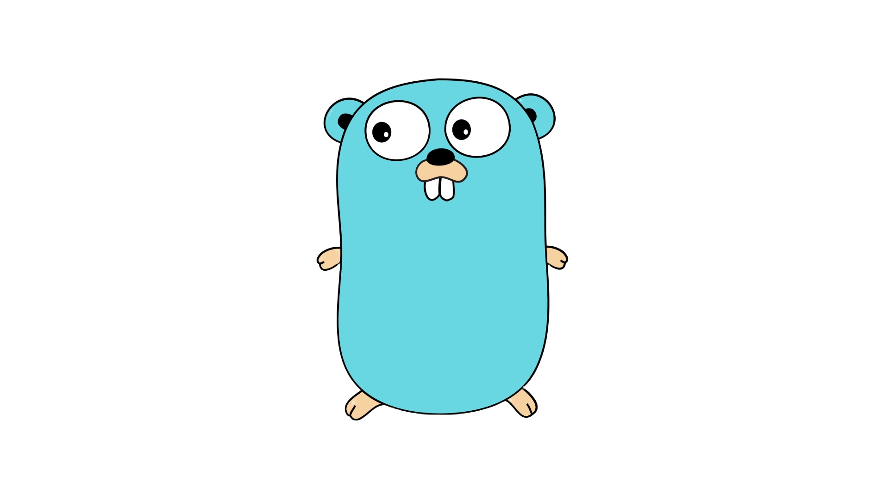

# Go API Microservices

  
  

  
  <b>Project Overview</b> 
  `go_api_microservices` is a Go-based microservices project, using Gin for routing and MongoDB for data storage. This API provides endpoints to retrieve data from `inventories` and `news` collections.

### Features

- RESTful API endpoints to interact with MongoDB.
- Utilizes Gin web framework for routing.
- MongoDB integration using Go driver.
- Clean and structured codebase.

## Getting Started

### Prerequisites

- Go (1.x or later)
- MongoDB
- Git

### Installation

1. **Clone the Repository**

2. **Set Up MongoDB**

- Ensure MongoDB is running.
- Use the `inventories` and `news` collections.

3. **Configure Environment Variables**
   Create a `.env` file in the root with your MongoDB URI:

4. **Run the Application**

## Usage

### API Endpoints

- **Get Inventories**
  `GET /inventories` - Fetches documents from the `inventories` collection.

- **Get News**
  `GET /news` - Retrieves documents from the `news` collection.

### Example Request

Using `curl` to fetch inventories:

## Contributing

Contributions are welcome. To contribute:

1. Fork the repository.
2. Create a new branch (`git checkout -b my-new-feature`).
3. Commit your changes (`git commit -am 'Add some feature'`).
4. Push to the branch (`git push origin my-new-feature`).
5. Create a new Pull Request.
